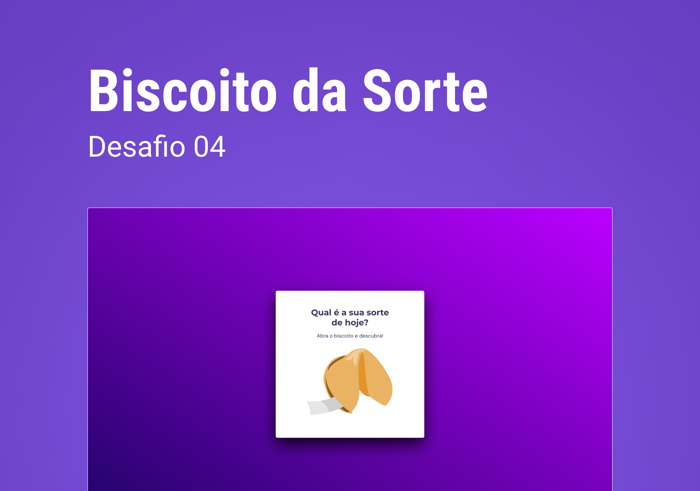

<h1 align="center"> Projeto do Biscoito da Sorte </h1>

Desafio 4 do curso explorer da RocketSeat, introduzindo JavaScript.

  <a href="#-tecnologias">Tecnologias</a>&nbsp;&nbsp;&nbsp;|&nbsp;&nbsp;&nbsp;
  <a href="#-projeto">Projeto</a>&nbsp;&nbsp;&nbsp;|&nbsp;&nbsp;&nbsp;
  <a href="#-layout">Layout</a>&nbsp;&nbsp;&nbsp;|&nbsp;&nbsp;&nbsp;
  <a href="#memo-licença">Licença</a>

  

 

  

## 🚀 Tecnologias

Esse projeto foi desenvolvido com as seguintes tecnologias:

- HTML
- CSS
- JavaScript
- Git e Github

## 💻 Projeto

Neste desafio estou fazendo um pequeno game de sorte, iniciando com o JavaScript.

## 🔖 Layout

Você pode visualizar o layout do projeto através [DESSE LINK](https://www.figma.com/file/fKNSpcvx37l5soEcFCGL4u/Biscoito-da-Sorte-(Community)?node-id=0%3A1&t=XuR66ncTCLn9ddgH-0). É necessário ter conta no [Figma](https://figma.com) para acessá-lo.

## :memo: Licença

Esse projeto está sob a licença MIT.

---

Feito com ♥ [Participe da nossa comunidade!](https://discord.gg/rocketseat) :wave:
